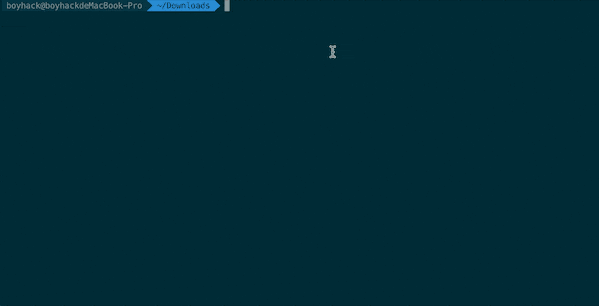

ksubdomain是一款基于无状态的子域名爆破工具，类似无状态端口扫描，支持在Windows/Linux/Mac上进行快速的DNS爆破，拥有重发机制不用担心漏包。

hacking8信息流的src资产收集 https://i.hacking8.com/src/ 用的是ksubdomain


## 安装
1. 下载二进制 https://github.com/boy-hack/ksubdomain/releases
2. 安装libpcap环境
   - Windows
     下载`npcap`驱动，winpcap驱动有人反馈无效
   - Linux
     已经静态编译打包libpcap，无需其他操作
   - MacOS
     自带libpcap,无需其他操作
3. 执行!
### 快速安装
需要`go 1.17`以上版本并安装`libpcap`环境，运行以下命令
```
go install -v github.com/boy-hack/ksubdomain/cmd/ksubdomain@latest
```

## Useage
```bash
NAME:
   KSubdomain - 无状态子域名爆破工具

USAGE:
   ksubdomain [global options] command [command options] [arguments...]

VERSION:
   1.8.6

COMMANDS:
   enum, e    枚举域名
   verify, v  验证模式
   test       测试本地网卡的最大发送速度
   help, h    Shows a list of commands or help for one command

GLOBAL OPTIONS:
   --help, -h     show help (default: false)
   --version, -v  print the version (default: false)

```

### 模式

**验证模式**
提供完整的域名列表，ksubdomain负责快速获取结果

```bash
./ksubdomain verify -h

NAME:
   ksubdomain verify - 验证模式

USAGE:
   ksubdomain verify [command options] [arguments...]

OPTIONS:
   --filename value, -f value   验证域名文件路径
   --band value, -b value       宽带的下行速度，可以5M,5K,5G (default: "2m")
   --resolvers value, -r value  dns服务器文件路径，一行一个dns地址
   --output value, -o value     输出文件名
   --silent                     使用后屏幕将仅输出域名 (default: false)
   --retry value                重试次数,当为-1时将一直重试 (default: 3)
   --timeout value              超时时间 (default: 6)
   --stdin                      接受stdin输入 (default: false)
   --only-domain, --od          只打印域名，不显示ip (default: false)
   --not-print, --np            不打印域名结果 (default: false)
   --dns-type value             dns类型 1为a记录 2为ns记录 5为cname记录 16为txt (default: 1)
   --help, -h                   show help (default: false)
```

```
从文件读取 
./ksubdomain v -f dict.txt

从stdin读取
echo "www.hacking8.com"|./ksubdomain v --stdin

读取ns记录
echo "hacking8.com" | ./ksubdomain v --stdin --dns-type 2
```

**枚举模式**
只提供一级域名，指定域名字典或使用ksubdomain内置字典，枚举所有二级域名

```bash
./ksubdomain enum -h

NAME:
   ksubdomain enum - 枚举域名

USAGE:
   ksubdomain enum [command options] [arguments...]

OPTIONS:
   --band value, -b value          宽带的下行速度，可以5M,5K,5G (default: "2m")
   --resolvers value, -r value     dns服务器文件路径，一行一个dns地址
   --output value, -o value        输出文件名
   --silent                        使用后屏幕将仅输出域名 (default: false)
   --retry value                   重试次数,当为-1时将一直重试 (default: 3)
   --timeout value                 超时时间 (default: 6)
   --stdin                         接受stdin输入 (default: false)
   --only-domain, --od             只打印域名，不显示ip (default: false)
   --not-print, --np               不打印域名结果 (default: false)
   --dns-type value                dns类型 1为a记录 2为ns记录 5为cname记录 16为txt (default: 1)
   --domain value, -d value        爆破的域名
   --domainList value, --dl value  从文件中指定域名
   --filename value, -f value      字典路径
   --skip-wild                     跳过泛解析域名 (default: false)
   --level value, -l value         枚举几级域名，默认为2，二级域名 (default: 2)
   --level-dict value, --ld value  枚举多级域名的字典文件，当level大于2时候使用，不填则会默认
   --help, -h                      show help (default: false)
```

```
./ksubdomain e -d baidu.com

从stdin获取
echo "baidu.com"|./ksubdomain e --stdin
```

## 特性和Tips

- 无状态爆破，有失败重发机制，速度极快
- 中文帮助，-h会看到中文帮助
- 两种模式，枚举模式和验证模式，枚举模式内置10w字典
- 将网络参数简化为了-b参数，输入你的网络下载速度如-b 5m，将会自动限制网卡发包速度。
- 可以使用./ksubdomain test来测试本地最大发包数
- 获取网卡改为了全自动并可以根据配置文件读取。
- 会有一个时时的进度条，依次显示成功/发送/队列/接收/失败/耗时 信息。
- 不同规模的数据，调整 --retry --timeout参数即可获得最优效果
- 当--retry为-1，将会一直重试直到所有成功。
- 支持爆破ns记录

## 与massdns、dnsx对比

使用10w字典，在4H5M的网络环境下测试

|          | ksubdomain                                                                      | massdns                                                      | dnsx                                                         |
| -------- |---------------------------------------------------------------------------------| ------------------------------------------------------------ | ------------------------------------------------------------ |
| 支持系统 | Windows/Linux/Darwin                                                            | Windows/Linux/Darwin                                         | Windows/Linux/Darwin                                         |
| 功能 | 支持验证和枚举                                                                         | 只能验证 | 只能验证 |
| 发包方式 | pcap网卡发包                                                                        | epoll,pcap,socket                                            | socket                                                       |
| 命令行 | time ./ksubdomain v -b 5m -f d2.txt -o ksubdomain.txt -r dns.txt --retry 3 --np | time ./massdns -r dns.txt -t AAAA -w massdns.txt d2.txt --root -o L | time ./dnsx -a -o dnsx.txt -r dns.txt -l d2.txt -retry 3 -t 5000 |
| 备注   | 加了--np 防止打印过多                                                                   |                                                              |                                                              |
| 结果   | 耗时:30s<br />成功个数:1397                                                           | 耗时:3m29.337s<br />成功个数:1396                            | 耗时:5m26.780s <br />成功个数:1396                           |

ksubdomain只需要1分半，速度远远比massdns、dnsx快~

## 参考

- 原ksubdomain https://github.com/knownsec/ksubdomain
- 从 Masscan, Zmap 源码分析到开发实践 <https://paper.seebug.org/1052/>
- ksubdomain 无状态域名爆破工具介绍 <https://paper.seebug.org/1325/>
- [ksubdomain与massdns的对比](https://mp.weixin.qq.com/s?__biz=MzU2NzcwNTY3Mg==&mid=2247484471&idx=1&sn=322d5db2d11363cd2392d7bd29c679f1&chksm=fc986d10cbefe406f4bda22f62a16f08c71f31c241024fc82ecbb8e41c9c7188cfbd71276b81&token=76024279&lang=zh_CN#rd) 

## 2.0更新
显著提高了DNS爆破的速度和效率：
### 1. 状态表优化
- 使用分片锁（Sharded Lock）代替全局锁，减少锁竞争
- 每个分片使用独立的锁，提高并发处理能力
- 优化键值存储，使用高效的哈希函数分布域名

### 2. 发包机制优化
- 使用对象池复用DNS包结构，减少内存分配和GC压力
- 实现模板缓存，为相同DNS服务器复用以太网/IP/UDP层
- 多工作协程并行发送数据包，提高吞吐量
- 批量处理域名发送，减少上下文切换开销

### 3. 接收机制优化
- 使用对象池复用解析器和缓冲区
- 多阶段并行处理管道：接收→解析→处理
- 增加缓冲区大小，避免通道阻塞
- 优化包过滤逻辑，更快地丢弃无效包

### 4. 内存管理优化
- 引入全局内存池，减少频繁分配/释放内存的开销
- 复用DNS查询结构和序列化缓冲区
- 延迟内存释放，减少内存碎片

### 5. 代码架构优化
- 使用CPU核心数动态调整并发协程数量
- 更高效的随机数生成方法
- 动态速率调整，根据系统负载自适应发包速率
- 批量加载和处理域名，减少单个域名处理开销

- 网卡配置文件可以环境变量传输 ksubdomain-config
- 调用指定网卡可通过环境变量设置 ksubdomain-eth
- 支持泛解析过滤
- 输出格式 txt(实时输出) json(扫描完成后，泛解析过滤后输出) csv(扫描完成后，泛解析过滤后输出)